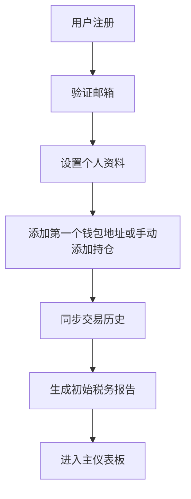
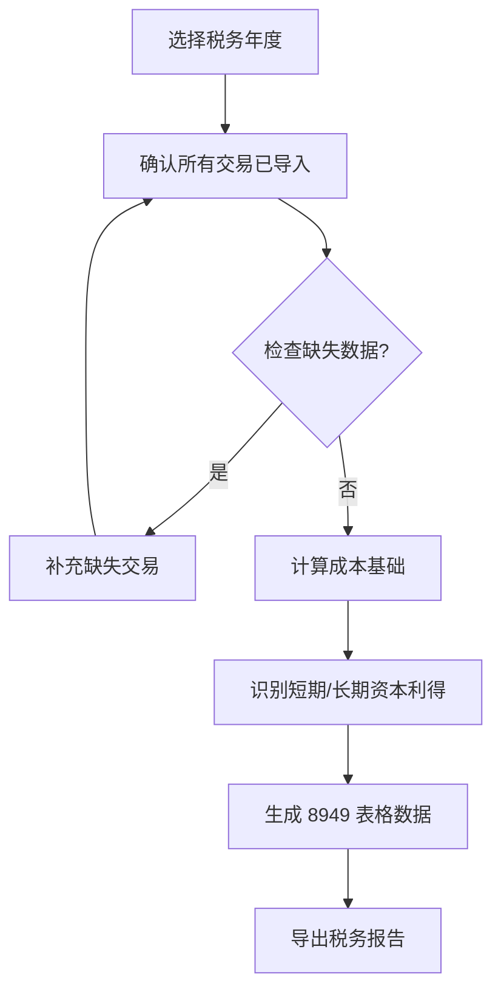

# Crypto Compliance Tracker - 产品需求文档

## 1. 产品概述

Crypto Compliance Tracker 是一款专为美国用户设计的加密货币投资组合追踪与税务合规工具。本应用帮助用户管理数字资产、追踪交易历史、计算税务责任，同时提供美国加密货币法规的实时更新和教育内容。

- 核心用途：加密货币投资组合管理、交易记录追踪、税务计算与报告生成
- 目标用户：在美国居住并持有加密货币的个人投资者
- 市场价值：帮助用户避免 IRS 罚款，确保税务合规，提升财务管理效率

---

## 2. 核心功能

### 2.1 用户角色

| 角色 | 注册方式 | 核心权限 |
|------|---------|---------|
| 普通用户 | 邮箱注册 | 浏览、管理投资组合、生成税务报告 |
| 高级用户 | 付费订阅 | 高级分析、多钱包支持、API 集成 |

### 2.2 功能模块

1. **首页/仪表板**：投资组合概览、市场行情、合规提醒
2. **投资组合管理**：添加/编辑加密货币持仓、实时价格更新
3. **交易记录**：导入交易历史、手动添加交易、分类标签
4. **税务计算**：成本基础计算、资本利得/亏损计算、税务报告生成
5. **合规中心**：美国 IRS 法规更新、税务提示、教育资源
6. **设置**：个人资料、API 密钥管理、导出选项

### 2.3 页面详情

| 页面名称 | 模块名称 | 功能描述 |
|---------|---------|---------|
| 首页仪表板 | 投资组合概览卡片 | 显示总资产价值、24小时变化、收益百分比 |
| | 市场行情模块 | 展示主流加密货币实时价格 |
| | 合规提醒 | 显示未处理的税务事件、截止日期提醒 |
| 投资组合页面 | 持仓列表 | 支持按币种、价值、盈亏排序 |
| | 添加资产弹窗 | 搜索币种、输入数量、选择钱包 |
| 交易记录页面 | 交易列表 | 支持筛选日期、币种、类型 |
| | 导入功能 | CSV/JSON 文件导入、钱包地址导入 |
| 税务中心页面 | 税务概览 | 年度收益/亏损汇总、短期/长期分类 |
| | 税务报告 | 生成 8949 表格数据、导出 PDF/CSV |
| 合规中心页面 | 法规动态 | IRS 最新指引、政策解读 |
| | 合规检查 | 自检清单、常见问题解答 |

---

## 3. 核心流程

### 3.1 用户注册与初始设置流程

### 3.2 税务报告生成流程

---

## 4. 用户界面设计

### 4.1 设计风格

- **设计理念**：专业可信赖的金融科技风格，融合现代极简主义与数据可视化美学
- **配色方案**：
  - 主色：深海军蓝 `#1a365d`（传达信任与专业）
  - 次色：翡翠绿 `#059669`（表示收益、正向）
  - 强调色：琥珀橙 `#d97706`（警示、提醒）
  - 背景：浅灰 `#f8fafc`、深灰 `#1e293b`
  - 文字：深灰 `#1e293b`、中灰 `#64748b`
- **字体**：
  - 标题：Inter（700 weight）
  - 正文：Inter（400/500 weight）
  - 数字：JetBrains Mono（等宽，用于金融数据）
- **按钮风格**：圆角 8px，微阴影，hover 时提升阴影深度
- **布局风格**：卡片式布局，左侧导航固定，右侧内容区自适应
- **图标风格**：Lucide Icons，统一 24px 尺寸

### 4.2 页面设计概览

| 页面名称 | 模块名称 | 视觉元素 |
|---------|---------|---------|
| 首页仪表板 | 投资组合卡片 | 大字体数值、渐变背景、动画数字计数 |
| | 行情表格 | 斑马条纹、hover 高亮、迷你走势图 |
| 投资组合页面 | 持仓卡片 | 币种图标、数值变化指示器、删除/编辑按钮 |
| | 饼图可视化 | 资产分布比例、交互式图例 |
| 税务中心页面 | 税务概览卡片 | 红绿对比展示盈亏、进度条显示税务进度 |
| | 报告生成器 | 分步表单、进度指示器、预览面板 |
| 合规中心页面 | 法规卡片 | 时间线设计、重要程度标签、法规摘要 |

### 4.3 响应式设计

- **桌面端优先**：1200px 以上为全功能布局
- **平板适配**：768px-1199px 隐藏侧边栏，汉堡菜单
- **移动端优化**：320px-767px 单列布局，底部标签导航

---

## 5. 合规性设计（美国法律）

### 5.1 数据隐私与安全

- 所有数据传输使用 HTTPS 加密
- 用户密码使用 bcrypt 哈希存储
- 支持双因素认证（2FA）
- 数据存储符合 SOC 2 标准

### 5.2 税务合规功能

- 支持 IRS Form 8949 格式导出
- 支持 Cost Basis 计算方法选择（FIFO、LIFO、HIFO、Specific ID）
- 自动识别交易类型（买卖、交换、挖矿、赠送）
- 区分短期（<1年）和长期（>1年）资本利得

### 5.3 免责声明

- 明确声明本应用不构成税务 advice
- 建议用户咨询专业税务顾问
- 提供 IRS 官方资源链接

---

## 6. 技术约束

- 浏览器兼容性：Chrome 90+、Firefox 88+、Safari 14+、Edge 90+
- 无需原生应用，纯 Web 端实现
- 数据本地存储优先，减少服务器依赖
