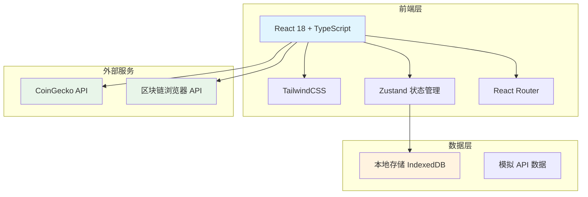
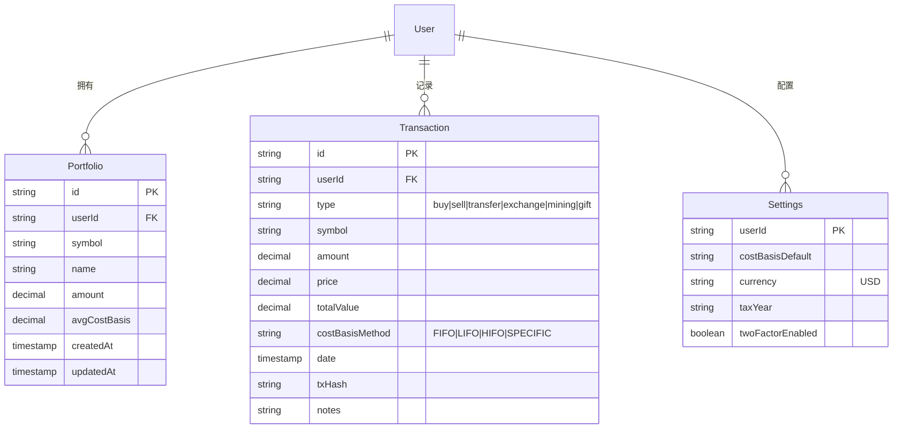

# Crypto Compliance Tracker - 技术架构文档

## 1. 架构设计



## 2. 技术选型

- **前端框架**：React 18 + TypeScript
- **构建工具**：Vite
- **样式方案**：TailwindCSS 3
- **状态管理**：Zustand
- **路由管理**：React Router DOM v6
- **图标库**：Lucide React
- **数据可视化**：Recharts
- **数据存储**：IndexedDB（使用 Dexie.js）
- **日期处理**：date-fns
- **数字格式化**：Intl.NumberFormat

## 3. 路由定义

| 路由 | 页面名称 | 权限 |
|------|---------|------|
| `/` | 首页仪表板 | 公开 |
| `/portfolio` | 投资组合管理 | 已登录 |
| `/transactions` | 交易记录 | 已登录 |
| `/tax` | 税务中心 | 已登录 |
| `/compliance` | 合规中心 | 公开 |
| `/settings` | 设置页面 | 已登录 |

## 4. 数据模型

### 4.1 数据模型定义



### 4.2 数据类型定义

```typescript
// 投资组合项
interface PortfolioItem {
  id: string;
  symbol: string;
  name: string;
  amount: number;
  avgCostBasis: number;
  currentPrice?: number;
  totalValue?: number;
  profitLoss?: number;
  profitLossPercent?: number;
}

// 交易记录
interface Transaction {
  id: string;
  type: 'buy' | 'sell' | 'transfer' | 'exchange' | 'mining' | 'gift';
  symbol: string;
  amount: number;
  price: number;
  totalValue: number;
  costBasisMethod: 'FIFO' | 'LIFO' | 'HIFO' | 'SPECIFIC';
  date: Date;
  txHash?: string;
  notes?: string;
  shortTerm?: boolean; // < 1 year
  longTerm?: boolean; // >= 1 year
}

// 税务报告
interface TaxReport {
  year: number;
  totalProceeds: number;
  totalCostBasis: number;
  totalGainLoss: number;
  shortTermGainLoss: number;
  longTermGainLoss: number;
  transactions: Transaction[];
}

// 市场数据
interface MarketData {
  symbol: string;
  name: string;
  currentPrice: number;
  priceChange24h: number;
  priceChangePercent24h: number;
  marketCap: number;
  image: string;
}
```

## 5. 核心模块设计

### 5.1 投资组合管理模块

**功能**：
- 添加/编辑/删除持仓
- 自动计算平均成本基础
- 实时价格更新（CoinGecko API）
- 盈亏计算与展示

### 5.2 税务计算引擎

**功能**：
- 支持 FIFO、LIFO、HIFO、Specific ID 成本基础计算方法
- 自动识别短期/长期资本利得
- 生成 IRS 8949 表格数据
- 导出 CSV/PDF 格式报告

### 5.3 合规信息中心

**功能**：
- IRS 最新指引展示
- 关键日期提醒（报税截止日）
- 合规检查清单
- 教育资源库

## 6. 项目结构

```
src/
├── components/
│   ├── common/          # 通用组件（Button、Card、Modal等）
│   ├── layout/          # 布局组件（Sidebar、Header等）
│   ├── portfolio/       # 投资组合相关组件
│   ├── tax/             # 税务相关组件
│   └── compliance/      # 合规相关组件
├── pages/
│   ├── Dashboard.tsx
│   ├── Portfolio.tsx
│   ├── Transactions.tsx
│   ├── TaxCenter.tsx
│   ├── Compliance.tsx
│   └── Settings.tsx
├── hooks/
│   ├── usePortfolio.ts
│   ├── useTax.ts
│   └── useMarketData.ts
├── stores/
│   └── appStore.ts
├── utils/
│   ├── taxCalculator.ts
│   ├── formatters.ts
│   └── storage.ts
├── types/
│   └── index.ts
├── data/
│   └── mockData.ts      # 模拟数据
├── App.tsx
├── main.tsx
└── index.css
```

## 7. API 集成

### 7.1 CoinGecko API（免费层）

- `/coins/markets` - 获取市场数据
- `/simple/price` - 获取实时价格
- 速率限制：10-50 次/分钟（免费层）

### 7.2 区块链浏览器 API

- Etherscan API - ETH 交易查询
- Blockchain.com API - BTC 交易查询

## 8. 性能优化

- 虚拟滚动处理长列表
- 防抖处理搜索输入
- 缓存市场数据（5分钟刷新）
- 图片懒加载
- 代码分割与按需加载
