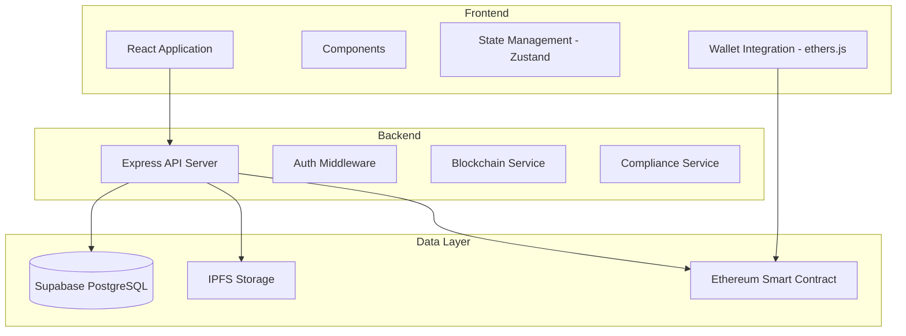
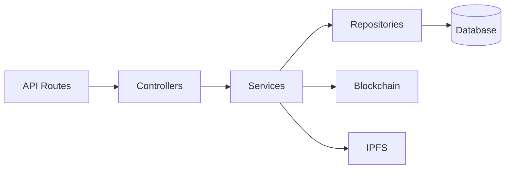
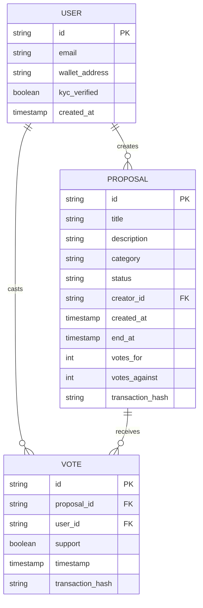

## 1. Architecture Design


## 2. Technology Description
- Frontend: React@18 + TypeScript + tailwindcss@3 + vite
- Initialization Tool: vite-init
- Backend: Express@4 + TypeScript
- Database: Supabase (PostgreSQL)
- Blockchain: Ethereum (Sepolia testnet), ethers.js v6
- Storage: IPFS (Pinata)
- Auth: Supabase Auth

## 3. Route Definitions
| Route | Purpose |
|-------|---------|
| / | Home page with stats and featured proposals |
| /proposals | Proposals list with filtering |
| /proposals/:id | Proposal detail and voting |
| /proposals/create | Create new proposal |
| /profile | User profile and history |
| /compliance | Legal and compliance information |
| /api/proposals | API: Get/create proposals |
| /api/votes | API: Submit votes |
| /api/compliance | API: KYC/AML verification |

## 4. API Definitions
```typescript
// Proposal Types
interface Proposal {
  id: string;
  title: string;
  description: string;
  category: string;
  status: 'draft' | 'active' | 'passed' | 'rejected';
  creatorId: string;
  createdAt: string;
  endAt: string;
  votesFor: number;
  votesAgainst: number;
  transactionHash?: string;
}

interface Vote {
  id: string;
  proposalId: string;
  userId: string;
  support: boolean;
  timestamp: string;
  transactionHash: string;
}

interface User {
  id: string;
  email: string;
  walletAddress?: string;
  kycVerified: boolean;
  createdAt: string;
}

// API Request/Response
interface CreateProposalRequest {
  title: string;
  description: string;
  category: string;
  endAt: string;
}

interface SubmitVoteRequest {
  proposalId: string;
  support: boolean;
  signature: string;
}

interface ApiResponse<T> {
  data: T;
  success: boolean;
  message?: string;
}
```

## 5. Server Architecture Diagram


## 6. Data Model
### 6.1 Data Model Definition


### 6.2 Data Definition Language
```sql
-- Users Table
CREATE TABLE users (
    id UUID PRIMARY KEY DEFAULT gen_random_uuid(),
    email VARCHAR(255) UNIQUE NOT NULL,
    wallet_address VARCHAR(42),
    kyc_verified BOOLEAN DEFAULT FALSE,
    created_at TIMESTAMP WITH TIME ZONE DEFAULT NOW()
);

-- Proposals Table
CREATE TABLE proposals (
    id UUID PRIMARY KEY DEFAULT gen_random_uuid(),
    title VARCHAR(255) NOT NULL,
    description TEXT NOT NULL,
    category VARCHAR(100) NOT NULL,
    status VARCHAR(20) DEFAULT 'draft',
    creator_id UUID REFERENCES users(id),
    created_at TIMESTAMP WITH TIME ZONE DEFAULT NOW(),
    end_at TIMESTAMP WITH TIME ZONE NOT NULL,
    votes_for INTEGER DEFAULT 0,
    votes_against INTEGER DEFAULT 0,
    transaction_hash VARCHAR(66)
);

-- Votes Table
CREATE TABLE votes (
    id UUID PRIMARY KEY DEFAULT gen_random_uuid(),
    proposal_id UUID REFERENCES proposals(id),
    user_id UUID REFERENCES users(id),
    support BOOLEAN NOT NULL,
    timestamp TIMESTAMP WITH TIME ZONE DEFAULT NOW(),
    transaction_hash VARCHAR(66),
    UNIQUE(proposal_id, user_id)
);

-- Enable Row Level Security
ALTER TABLE users ENABLE ROW LEVEL SECURITY;
ALTER TABLE proposals ENABLE ROW LEVEL SECURITY;
ALTER TABLE votes ENABLE ROW LEVEL SECURITY;

-- Policies
CREATE POLICY "Users can view their own data" ON users
    FOR SELECT USING (auth.uid()::text = id::text);

CREATE POLICY "Proposals are viewable by everyone" ON proposals
    FOR SELECT USING (true);

CREATE POLICY "Users can create proposals" ON proposals
    FOR INSERT WITH CHECK (auth.uid()::text = creator_id::text);

CREATE POLICY "Votes are viewable by everyone" ON votes
    FOR SELECT USING (true);

CREATE POLICY "Users can create votes" ON votes
    FOR INSERT WITH CHECK (auth.uid()::text = user_id::text);

-- Grants
GRANT SELECT ON users TO anon;
GRANT SELECT, INSERT ON proposals TO anon, authenticated;
GRANT SELECT, INSERT ON votes TO anon, authenticated;
GRANT ALL PRIVILEGES ON users TO authenticated;
GRANT ALL PRIVILEGES ON proposals TO authenticated;
GRANT ALL PRIVILEGES ON votes TO authenticated;
```
