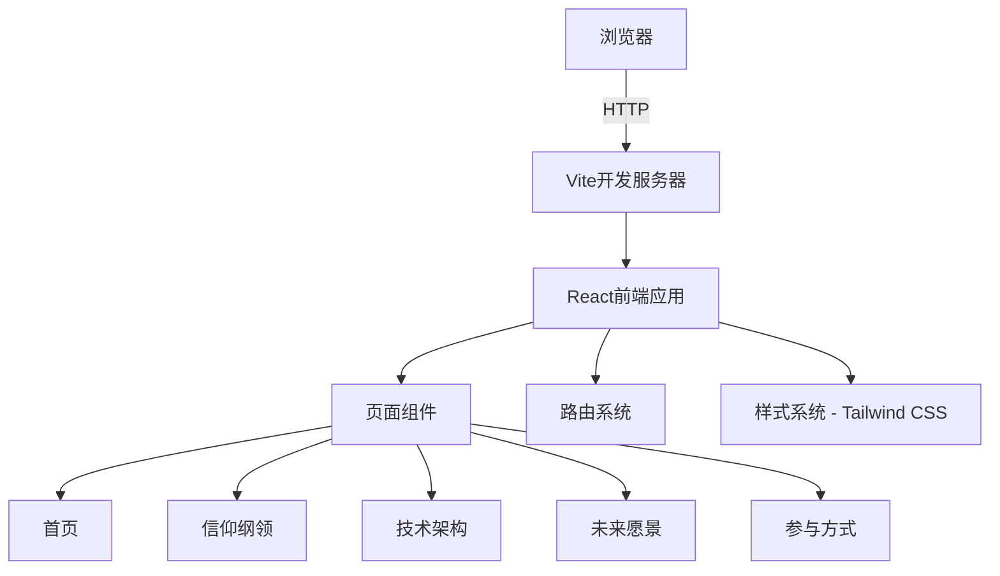

## 1. Architecture Design


## 2. Technology Description
- Frontend: React@18 + TypeScript + tailwindcss@3 + vite
- Initialization Tool: vite-init
- Backend: None (纯前端项目)
- Database: None
- 路由管理: react-router-dom
- 状态管理: zustand (可选，按需使用)

## 3. Route Definitions
| Route | Purpose |
|-------|---------|
| / | 首页，展示项目概览和核心信仰 |
| /manifesto | 信仰纲领页面，详细展示信仰体系 |
| /technology | 技术架构页面，展示AI底层代码 |
| /roadmap | 未来愿景页面，展示发展路线 |
| /contribute | 参与方式页面，展示如何贡献 |

## 4. 项目结构
```
/workspace/
├── src/
│   ├── components/       # 通用组件
│   │   ├── Navbar.tsx
│   │   ├── Footer.tsx
│   │   └── Card.tsx
│   ├── pages/           # 页面组件
│   │   ├── Home.tsx
│   │   ├── Manifesto.tsx
│   │   ├── Technology.tsx
│   │   ├── Roadmap.tsx
│   │   └── Contribute.tsx
│   ├── App.tsx          # 主应用组件
│   ├── main.tsx         # 入口文件
│   └── index.css        # 全局样式
├── public/              # 静态资源
├── index.html           # HTML模板
├── vite.config.ts       # Vite配置
├── tailwind.config.js   # Tailwind配置
├── tsconfig.json        # TypeScript配置
└── package.json         # 项目依赖
```

## 5. 核心组件设计

### 5.1 页面组件
- **Home.tsx**: 英雄区、核心信仰卡片、项目简介
- **Manifesto.tsx**: 完整信仰纲领内容展示
- **Technology.tsx**: 代码展示和技术架构说明
- **Roadmap.tsx**: 发展时间线展示
- **Contribute.tsx**: 参与指南和联系方式

### 5.2 通用组件
- **Navbar.tsx**: 导航栏，包含所有页面链接
- **Footer.tsx**: 页脚，包含版权和联系信息
- **Card.tsx**: 可复用的卡片组件
