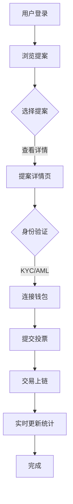

## 1. Product Overview
去中心化AI治理投票系统，参考比特币和以太坊的设计思想，提供符合美国法律的区块链投票平台，实现AI伦理决策的全民参与。

## 2. Core Features

### 2.1 User Roles
| Role | Registration Method | Core Permissions |
|------|---------------------|------------------|
| Normal User | Email/Social login | Browse proposals, vote, create proposals |
| Admin | Pre-approved | Manage platform, verify users, moderate content |

### 2.2 Feature Module
1. **Home page**: Hero section, live voting statistics, featured proposals
2. **Proposals page**: Proposal list, filtering, search
3. **Proposal detail page**: Proposal content, voting interface, discussion
4. **Create proposal page**: Proposal creation form, submission
5. **User profile page**: User info, voting history, created proposals
6. **Compliance page**: Legal disclosures, KYC/AML info, terms of service

### 2.3 Page Details
| Page Name | Module Name | Feature description |
|-----------|-------------|---------------------|
| Home page | Hero section | Animated background, call-to-action buttons, platform stats |
| Home page | Live stats | Real-time voting data, blockchain block height, active users |
| Home page | Featured proposals | Curated list of important proposals |
| Proposals page | Proposal list | Grid/card view, filtering by status/category |
| Proposal detail | Voting interface | Secure voting with wallet integration, vote confirmation |
| Proposal detail | Discussion | Comment system, reply functionality |
| Create proposal | Form wizard | Step-by-step proposal creation, preview |
| User profile | Voting history | Timeline of user's votes and proposals |
| Compliance | Legal info | Regulatory disclosures, privacy policy, terms |

## 3. Core Process
用户注册/登录 → 浏览提案 → 查看提案详情 → 连接钱包/验证身份 → 投票 → 投票结果上链 → 实时统计更新

## 4. User Interface Design
### 4.1 Design Style
- Primary colors: Deep blue (#0F172A), Teal (#14B8A6)
- Secondary colors: Amber (#F59E0B), Slate gray (#64748B)
- Button style: Rounded corners, subtle shadows, hover animations
- Fonts: Space Grotesk (display), Inter (body)
- Layout style: Card-based, grid layouts, generous whitespace
- Icon style: Lucide icons, minimalist, consistent stroke width

### 4.2 Page Design Overview
| Page Name | Module Name | UI Elements |
|-----------|-------------|-------------|
| Home page | Hero section | Gradient background, animated particles, large typography |
| Proposals page | List view | Card grid, hover effects, status badges |
| Proposal detail | Voting | Glassmorphism cards, smooth transitions, confirmation modals |
| Compliance | Legal info | Clean typography, collapsible sections, clear hierarchy |

### 4.3 Responsiveness
- Desktop-first design with mobile breakpoints at 768px and 480px
- Touch-optimized for mobile devices
- Adaptive layouts for different screen sizes

### 4.4 Blockchain Elements
- Block explorer integration
- Transaction hash display
- Wallet connection UI
- Gas fee estimation
