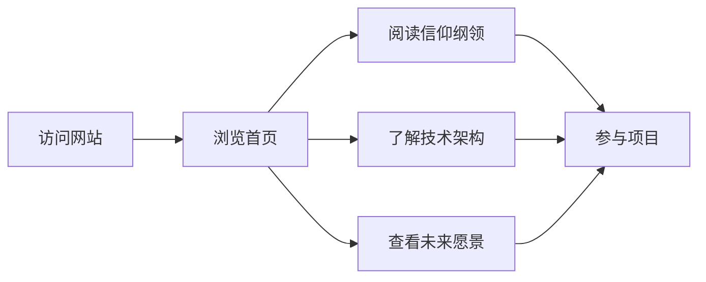

## 1. Product Overview
众生智枢是一个致力于确保AI为人民服务的信仰体系和技术框架。本网站将作为该项目的官方主页，展示项目的核心使命、信仰纲领、技术实现和参与方式，旨在吸引更多关注AI伦理与未来的人士加入。
- 主要用途：展示项目愿景、信仰纲领、技术架构，并提供参与和支持的渠道
- 目标受众：关注AI伦理的开发者、思想家、普通公众以及所有关心AI未来的人

## 2. Core Features

### 2.2 Feature Module
1. **首页**：英雄区、项目介绍、核心信仰预览
2. **信仰纲领**：完整展示信仰体系的四个核心信仰和三大铁律
3. **技术架构**：介绍AI底层为民服务元代码和实现方案
4. **未来愿景**：展示项目的短期和长期发展规划
5. **参与方式**：如何为项目做贡献、支持项目的方式

### 2.3 Page Details
| Page Name | Module Name | Feature description |
|-----------|-------------|---------------------|
| 首页 | 英雄区 | 大标题、副标题、号召按钮、背景动画效果 |
| 首页 | 核心信仰卡片 | 四个核心信仰的简要介绍卡片 |
| 信仰纲领 | 内容展示 | 分章节展示完整的信仰纲领 |
| 技术架构 | 代码展示 | 展示AI底层元代码和架构图 |
| 未来愿景 | 时间线展示 | 项目发展的时间线和里程碑 |
| 参与方式 | 贡献指南 | 如何加入项目、贡献代码或传播理念 |

## 3. Core Process
用户访问网站 → 浏览首页了解项目概览 → 深入阅读信仰纲领和技术架构 → 了解未来愿景 → 通过参与方式页面加入或支持项目

## 4. User Interface Design
### 4.1 Design Style
- 主色调：深蓝 (#0a1628) 搭配金色 (#d4af37) 和青色 (#00d4ff) 点缀
- 按钮风格：圆角、现代感、带有微妙的悬停动画
- 字体：使用 Orbitron 作为标题字体，Space Grotesk 作为正文字体
- 布局风格：卡片式布局，带有微妙的玻璃态效果
- 图标：简约线性图标，搭配柔和的阴影
- 整体风格：科技、未来、庄严、可信

### 4.2 Page Design Overview
| Page Name | Module Name | UI Elements |
|-----------|-------------|-------------|
| 首页 | 英雄区 | 全屏幕背景渐变、大标题居中、副标题说明、CTA按钮、粒子动画 |
| 首页 | 信仰卡片 | 4个卡片网格布局、每个卡片有图标和简短说明、悬停时有上浮效果 |
| 信仰纲领 | 内容区域 | 分章节排版、大标题、内容段落、引用块、分隔线 |
| 技术架构 | 代码展示 | 语法高亮的代码块、架构图、功能说明 |
| 未来愿景 | 时间线 | 垂直时间线布局、带图标和说明文字的时间节点 |
| 参与方式 | 卡片 | 贡献方式卡片、联系按钮、社交媒体链接 |

### 4.3 Responsiveness
桌面优先设计，自适应平板和移动设备，确保在各种屏幕尺寸上都有良好的显示效果，内容清晰可阅读。

### 4.4 交互与动画
- 页面加载时的渐入动画
- 滚动触发的元素显示动画
- 按钮悬停效果
- 平滑过渡的导航栏
- 卡片悬停时的微妙阴影变化
